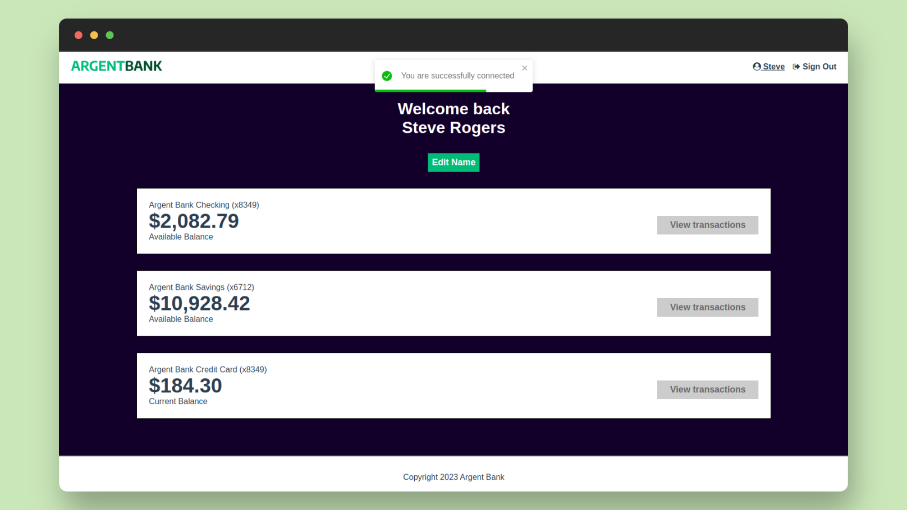

[](https://nodejs.org/)
[](https://vitejs.dev/)
[](https://reactjs.org/)
[](https://redux-toolkit.js.org/)
[](https://swagger.io/)

# oc-p13-argentbank 👋

This project is the n°13 of the [OpenClassrooms Front-End learning path](https://openclassrooms.com/fr/paths/516-developpeur-dapplication-javascript-react). I work at the Remede Agency, a web agency. We are developing a full-stack app for a new bank company, ArgentBank

The backend is provided with a tiny data set of two users. My goals are :
- Build a responsive React App with three pages : home, signup and profile according to previous designs 
- Add an authentication system with Redux
- Document the API with Swagger : phase 2 transactions

## ✨ Interface



## 🚨 Prerequisites

To get and build the project you will need to install :

- [NodeJS](https://nodejs.org/)
- A terminal to run commands. If you don't have one, I would recommend to use [Visual Studio Code](https://code.visualstudio.com/), it provides an integrated terminal inside the code editor.
- Optional : Pnpm instead of npm
- Optional : [Git](https://git-scm.com/)

## 🛠️ Installation

Please refer to the server/README.md for further details about the backend.

**Server**
```sh
$ cd backend
$ pnpm install
```

**Client**
```sh
$ cd client
$ pnpm install
```

## 🚀 Usage
You need to start the server and the client.

**Server**
```sh
$ cd backend
$ pnpm run dev
```

**Client**
```sh
$ cd client
$ pnpm run dev
```

And open the browser at this address : http://localhost:5173/

You can provide these data to get access to the profile page :
- Email: `steve@rogers.com`,
- Password: `password456`

Note that you can also check the "Remember me" checkbox to store your authentification data. If you want to clear those, you need to click on the "Logout" button.

Have a try Steve !

ℹ️ **Note**: the Accounts part inside the Profile page is not yet implemented. The data displayed are static.

## 👤 Authors
- Client : [@jeromeabel](https://github.com/jeromeabel)
- Backend : [OpenClassrooms-Student-Center](https://github.com/OpenClassrooms-Student-Center/Project-10-Bank-API)

## 📝 License
- Client : [GNU--GPL--3](https://www.gnu.org/licenses/gpl-3.0.fr.html)
